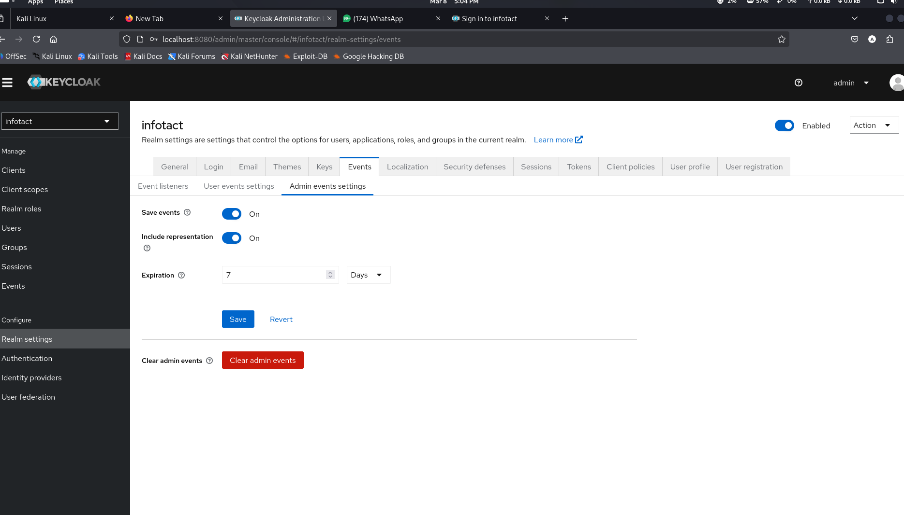
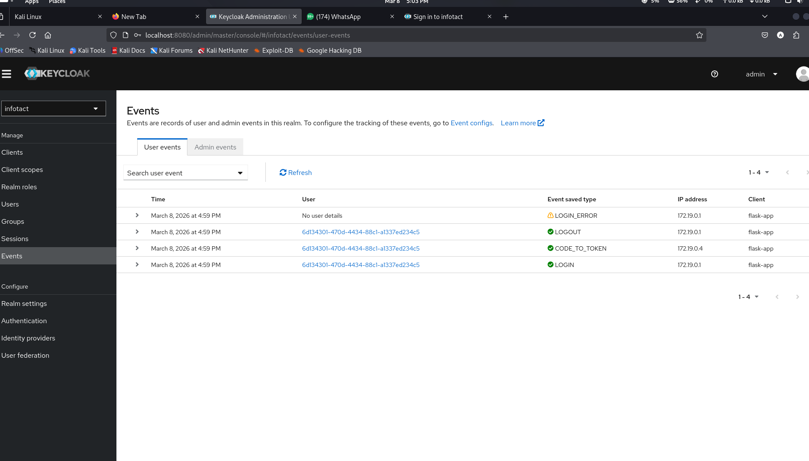
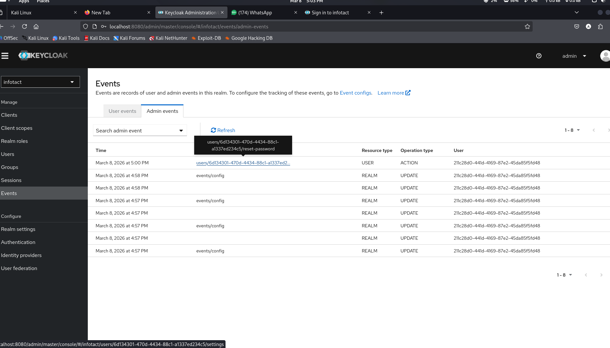
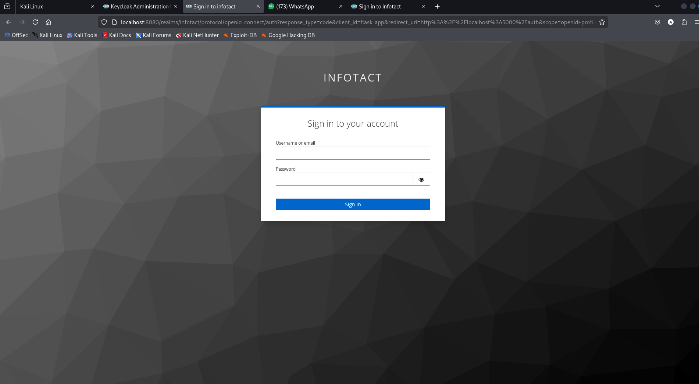
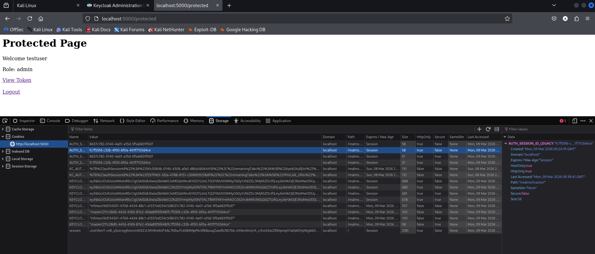
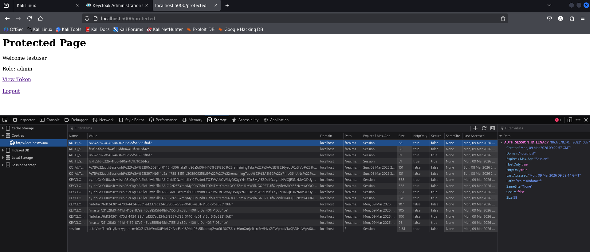

# 🔐 Week 4 – Auditing & Hardening


---

# 📌 Overview

Week 4 focuses on **security auditing and hardening** of the centralized identity provider built in previous weeks.

The objective is to ensure that authentication activities are **monitored, logged, and protected against common attack vectors**.

This stage introduces:

• Authentication event monitoring  
• Administrative action logging  
• Login theme customization  
• Security testing against common vulnerabilities  

The result is a **secure and auditable Identity and Access Management (IAM) environment**.

---

# 🏗 Architecture

```
User
 │
 ▼
Flask Application
 │
 ▼
Keycloak Identity Provider
 │
 ├── RBAC Policies
 ├── Group-Based Authorization
 ├── Multi-Factor Authentication
 ├── Event Logging
 ├── Admin Audit Logs
 │
 ▼
PostgreSQL Database
```

---

# 🔐 Security Controls Implemented

## 1️⃣ User Event Logging

User authentication events were enabled to monitor security activities within the identity provider.

Events include:

```
LOGIN
LOGIN_ERROR
LOGOUT
CONFIGURE_TOTP
UPDATE_PASSWORD
UPDATE_PROFILE
VERIFY_EMAIL
```

These logs allow administrators to detect:

```
Unauthorized login attempts
Account compromise indicators
Suspicious authentication activity
```

---

## 2️⃣ Admin Event Logging

Administrative activities are also logged for auditing purposes.

Examples of monitored actions:

```
CREATE_USER
DELETE_USER
UPDATE_CLIENT
UPDATE_REALM
UPDATE_ROLE
```

This ensures accountability for administrative changes within the identity infrastructure.

---

# 🧪 Security Testing

Several security checks were performed to validate the integrity of the authentication system.

---

## Open Redirect Testing

An attempt was made to manipulate the redirect URI during authentication.

Example test:

```
http://localhost:8080/realms/infotact/protocol/openid-connect/auth?redirect_uri=http://evil.com
```

Result:

```
Invalid redirect URI
```

Keycloak correctly blocks unauthorized redirect destinations, preventing open redirect attacks.

---

## Session Fixation Testing

Session fixation protection was verified by inspecting authentication cookies before and after login.

Procedure:

1. Capture session cookie before authentication
2. Login successfully
3. Inspect session cookie again

Result:

```
Session ID changed after authentication
```

This confirms that Keycloak regenerates sessions and protects against session fixation attacks.

---

# 🎨 Login Theme Customization

The login interface was customized using the built-in Keycloak theme configuration.

Updated theme:

```
keycloak.v2
```

This allows branding and improved UI styling for authentication pages.

---

# 📂 Project Structure

```
Week-4-Auditing-and-Hardening
│
├── screenshots
│   ├── event-logging-enabled.png
│   ├── user-events-log.png
│   ├── login-error-event.png
│   ├── admin-events-log.png
│   ├── login-theme.png
│   ├── open-redirect-test.png
│   ├── session-cookie-before.png
│   └── session-cookie-after.png
│
└── README.md
```

---

# 📸 Screenshots

## Event Logging Enabled

Shows configuration of user and admin event logging.



---

## User Event Logs

Displays authentication events recorded by Keycloak.



---

## Failed Login Event

Example of login error captured in the event logs.


---

## Admin Event Logs

Administrative activities monitored in the system.



---

## Login Theme Configuration

Custom login theme applied to the authentication interface.



---

## Open Redirect Security Test

Verification that Keycloak prevents unauthorized redirect URLs.


---

## Session Fixation Test

Session cookies compared before and after authentication.

Before login:



After login:



---

# 🎯 Week 4 Gate Check

The auditing and hardening objectives are satisfied when:

```
✔ User authentication events are logged
✔ Admin actions are logged
✔ Failed login attempts are recorded
✔ MFA activity is tracked
✔ Open redirect protection verified
✔ Session fixation protection verified
✔ Login interface customized
```

All security requirements were successfully implemented and validated.

---

# 🔒 Security Improvements Achieved

```
Identity infrastructure monitoring
Authentication activity auditing
Administrative accountability
Protection against redirect attacks
Session hijacking mitigation
Enhanced authentication interface
```

---

# 📚 Technologies Used

```
Keycloak
Docker
PostgreSQL
Flask
OpenID Connect
JWT
TOTP Authentication
```

---

# 👨‍💻 Project

Centralized Zero Trust Identity Provider

Cybersecurity Architecture Lab
